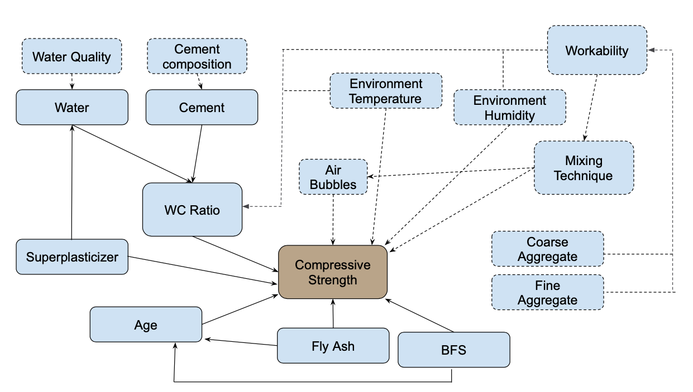

\newpage
```{r include = F}
library(corrplot)
library(tidyverse)
library(knitr)
library(dplyr)
library(scales)
library(cowplot)
library(patchwork)
library(stargazer)
knitr::opts_chunk$set(echo=FALSE, message=FALSE)

# \usepackage{chemformula}
```

```{r source functions from project, echo = FALSE, include = F}
source('../src/get_robust_se.R')
```


```{r reading split, include = F}
data <- read.csv("../src/data/interim/Concrete_Data.csv")

# If exploration/test split exists: load it. Otherwise, create and save it.
if (file.exists("../src/data/interim/Concrete_Data_test.csv")) {
  exploration <- read.csv("../src/data/interim/Concrete_Data_exploration.csv")
  test <- read.csv("../src/data/interim/Concrete_Data_test.csv")
} else {
  split <- sample(c(rep(0, 0.7 * nrow(data)), rep(1, 0.3 * nrow(data))))
  exploration <- data[split1 == 1, ]
  test <- data[split1== 0, ]
  write.csv(exploration, "../src/data/interim/Concrete_Data_exploration.csv", row.names = F)
  write.csv(test, "../src/data/interim/Concrete_Data_test.csv", row.names = F)
}

#rename columns
names(exploration) <- c("Cement", "BFS", "Fly_Ash", "Water", "SP","Coarse_Ag.", "Fine_Ag.", "Age", "Comp_Str" )
names(test) <- c("Cement", "BFS", "Fly_Ash", "Water", "SP","Coarse_Ag.", "Fine_Ag.", "Age", "Comp_Str" )

# create variable water/cement ratio
exploration <- exploration %>%
  mutate(
    WC_ratio = Water/Cement,
    WB_ratio = Water/(Cement + BFS +Fly_Ash + SP ),
    slag_cat = case_when(
            BFS == 0 ~ 0,
            BFS > 0 ~ 1),
    ash_cat = case_when(
            Fly_Ash == 0 ~ 0,
            Fly_Ash > 0 ~ 1),
    SP_cat = case_when(
            SP == 0 ~ 0,
            SP > 0 ~ 1)
    )

test <- test %>%
  mutate(
    WC_ratio = Water/Cement,
    slag_cat = case_when(
            BFS == 0 ~ 0,
            BFS > 0 ~ 1),
    ash_cat = case_when(
            Fly_Ash == 0 ~ 0,
            Fly_Ash > 0 ~ 1),
    SP_cat = case_when(
            SP == 0 ~ 0,
            SP > 0 ~ 1)
    )
```


```{r Further EDA, include = F}
# There are no NA's
summary(exploration)

text_size <- 7

plot_ash <- exploration %>%
  ggplot(aes(x = Fly_Ash)) +
  geom_histogram() + theme_bw() + theme(text=element_text(size=text_size))
plot_wc <- exploration %>%
  ggplot(aes(x = WC_ratio)) +
  geom_histogram() + theme_bw() + theme(text=element_text(size=text_size))
plot_wc_log <- exploration %>%
  ggplot(aes(x = log(WC_ratio))) +
  geom_histogram() + theme_bw() + theme(text=element_text(size=text_size))
plot_plast <- exploration %>%
  ggplot(aes(x = SP)) +
  geom_histogram() + theme_bw() + theme(text=element_text(size=text_size))
plot_age <- exploration %>%
  ggplot(aes(x = Age)) +
  geom_histogram()  + theme_bw() + theme(text=element_text(size=text_size))
plot_log_age <- exploration %>%
  ggplot(aes(x = log(Age))) +
  geom_histogram() + theme_bw() + theme(text=element_text(size=text_size))
plot_compressive <- exploration %>%
  ggplot(aes(x = Comp_Str)) +
  geom_histogram() + theme_bw() + theme(text=element_text(size=text_size))
plot_cement <- exploration %>%
  ggplot(aes(x = Cement)) +
  geom_histogram() + theme_bw() + theme(text=element_text(size=text_size))
plot_slag <- exploration %>%
  ggplot(aes(x = BFS)) +
  geom_histogram() + theme_bw() + theme(text=element_text(size=text_size))

```

```{r Visualize compressive strength as funciton of other variables}
scatter_1 <- exploration %>%
  ggplot(aes(x = (WC_ratio), y = (Comp_Str) )) + #, color = Age )) +
  geom_point() +
  scale_color_gradient2(low ="#deebf7", mid = "#9ecae1", high = "#3182bd", midpoint = 150) +
  theme_bw() + theme(text=element_text(size=8)) +
  labs(x = "Water/Cement Ratio", y = "Compressive strength")  # title = " Compressive strength VS. WC Ratio",

scatter_2 <- exploration %>%
  ggplot(aes(x = (Age), y = (Comp_Str) )) + #, color = WC_ratio )) +
  geom_point() +
  scale_color_gradient2(low ="#e7e1ef", mid = "#c994c7", high = "#dd1c77", midpoint = 1) +
  theme_bw() + theme(text=element_text(size=8)) +
  labs(x = "Age", y = "Compressive strength")  # title = " Compressive strength VS. Age",

```

```{r include = F}
cor_fig <- {corrplot(cor(na.omit(exploration[ , -c(6,7,11,12,13,14)])), method = 'number', tl.srt=45, cl.cex = 0.4, tl.cex = 0.4, number.cex = 0.4,  type = "lower", tl.col = "black"); recordPlot()}   # mar = c(0,0,2,0) is supposed to fix the cutoff, but does not...
```


# Introduction
Concrete is the second most-used substance in the world, after water\footnote{Gagg, Colin R. "Cement and concrete as an engineering material: An historic appraisal and case study analysis." Engineering Failure Analysis 40 (2014): 114-140.}. In the construction industry, concrete is the most used building material, and is found in a wide range of structures, such as buildings, bridges, roads, and dams.

Concrete is a composite material comprised of aggregate solids glued together with a paste that hardens over time. Concrete has three essential ingredients: cement, water, and solid aggregates\footnote{https://concretesupplyco.com/concrete-basics/}. Cement and water form a pasted called the binder. Inert coarse materials such as coarse rocks or gravel form the filler. The binder paste glues the solids in the filler into a conglomerate.

When the cement is in contact with water, it undergoes a hydration process. In this reaction, calcium silicates are produced. Equation 1 shows this reaction for tricalcium silicate. This molecule determines the strength of the concrete at the early stages of curing\footnote{http://matse1.matse.illinois.edu/concrete/prin.html}.

\begin{equation}
2 \textrm{Ca}_{3}\textrm{SiO}_{5} \rightarrow  3 \textrm{CaO.2SiO}_{2}.4\textrm{H}_{2}\textrm{O} + 3\textrm{Ca(OH)}_{2} + 173.6 \textrm{kJ}
\end{equation}

The properties of the cement paste determine the properties of the concrete. Over time, the concrete will continue to harden and gain strength for a long period of time.

The filler or aggregates are the solids glued together by the cement paste. They range in size and shape, from sand to coarse rocks. These aggregates can represent 70 to 80 percent of the volume of concrete.

In addition to these essential ingredients, modern concrete mixtures also incorporate additional ingredients, such as fly ash, blast furnace slag, and other chemical additives to reduce costs, accelerate the curing time or improve workability and increase strength\footnote{https://www.ijser.org/researchpaper/Use-of-Blast-Furnace-Slag-Aggregate-in-Concrete.pdf}.

The water/cement ratio (WC ratio) is considered the most important characteristic of concrete\footnote{https://mastercivilengineer.com/significance-of-water-to-cement-ratio/}. This property controls the strength, workability and durability of the product. There is a large body of research showing the importance of this property for the use of concrete\footnote{Aitcin,P.-C. "The importance of the water-cement and water-binder ratios." Science of Technology of Concrete Admixtures (2016): 3-23 \url{https://www.sciencedirect.com/science/article/pii/B9780081006931000011}}

The design of concrete mixtures depends on the desired characteristics of the concrete for a given application, site requirements and cost considerations\footnote{https://concretesupplyco.com/concrete-mix-design/}. Our team is interested in learning **how the water/cement ratio affects the strength of concrete**.


```{r variables table, echo=FALSE, message=FALSE, warnings=FALSE, results='asis'}
require(pander)
panderOptions('table.split.table', Inf)
set.caption("A summary of the covariates used in the study, and their applied transformations.")
my.data <- " Variable name | Common name | Unit of measure | Transformation
WC_ratio | Water to cement ratio | NA | Log
Age | Age | Days | Log
BFS | Blast furnace slag | NA | Categorical
Fly_Ash | Fly ash | NA | Categorical
SP | Superplasticizer | NA | Categorical"
df <- read.delim(textConnection(my.data),header=FALSE,sep="|",strip.white=TRUE,stringsAsFactors=FALSE)
names(df) <- unname(as.list(df[1,])) # put headers on
df <- df[-1,] # remove first row
row.names(df)<-NULL
pandoc.table(df, style = 'grid', keep.line.breaks = TRUE, justify = 'left')
```

# Data and Methodology
## Data Source
Our team sourced a multivariate dataset from the UC Irvine Machine Learning Repository\footnote{\url{https://archive-beta.ics.uci.edu/ml/datasets/concrete+compressive+strength}} describing the ratio of ingredients and age of 1030 different concrete mixtures, and their measured compressive strength.
The dataset is built from 17 different sources, which brings some limitations around specific control of the sub-type of ingredients across samples (i.e.: the type of ash was not controlled, just the amount). Nonetheless, all ingredient ratios were controlled within reasonable limits.

In our research design, we randomly sampled 30% of the observations to keep aside for exploration, while the remaining 70% of the observations were used to fitting the models.


```{r include = T, warning = F, fig.cap="Distribution of covariates and selected transformations.", fig.pos='h', fig.height = 2, fig.width = 6}
plot_grid(plot_compressive, plot_slag, plot_plast, plot_ash, plot_wc, plot_wc_log, plot_age, plot_log_age, ncol = 4)
```

## Characteristics and transformations

The `compressive strength` measurement is our outcome variable. `Compressive strength` is measured in megapascals (MPa), and is observed in the data from 3.32 MPa to 81.75 MPa, with a mean of 35.07 MPa. Figure 1 shows the distribution of `compressive strength`, which is observed to be relatively normal.

The `WC ratio` was calculated from the `water` and `cement` variables in the dataset. The `WC ratio` is commonly expressed as a mass ratio since the components of concrete are weighed before preparation.

The remaining variables in the dataset correspond to the age of the concrete, the aggregates in the filler and additives. These variables have an effect on the `compressive strength` of the final mixture, as explained in the introduction, and will serve as covariates. Table 1 provides a summary of the variable names in the dataset, their common name, their unit of measure, and whether the variable will be considered metric or categorical. Figure 1 shows the distribution of the covariates, as well as relevant transformations.

Figure 2 shows the correlations between our variables of interest. We observe a lack of perfect correlation between measured variables.


```{r include = T, warning = F, fig.cap="Correlation table between variables in the dataset", fig.pos='b!', fig.height = 2.3}
cor_fig
```


In Figure 3, the left panel shows `compressive strength` as a function of `w/c ratio`. We notice a downward trend of the sample's `compressive strength` as the `WC ratio` increases. This indicates that the reducing the amount of water in the mixture increases the concrete strength.

In Figure 3, in the right panel, we see a positive trend between `age` and `compressive strength`. This indicates that as the concrete ages, its strength increases. first rapidly and then slowly.
The above trends warrant further investigation, and particular care will be taken to observe these trends in our models, given their relationship to key performance metrics for our business.

```{r include = T, warning = F, fig.cap="Scatterplot showing a negative relationship between `w/c ratio` and `compressive strength` (left), and scatterplot showing a positive relationship between `age` and `compressive strength` (right)", fig.pos='b!', fig.height = 2, fig.width = 6}
plot_grid(scatter_1, scatter_2, nrow = 1)
```


## Transformations

While there are no NA values in our dataset, we note the presence of several 0 values, which we will leverage to transform those variables to categorical.

From Figure 1, we observe that the `WC ratio` has a skewed distribution towards the lower range. We will apply a logarithmic transformation to this variable to alleviate this issue. Similarly, in the same figure, we can see from the distribution of `age` that most concrete samples were tested for less than 100 days, and only a few samples were tested for up to a year. We will apply a logarithmic transformation to this variable as well.

While all measured variables are metric, we will consider the presence of additives in the model as categorical variables. `Ash`, `BFS`, and `SP` were introduced as considered categorical (either included or excluded in the mixture), given that the dataset contains enough observations of both cases.


# Proposed Models

The primary outcome that we are interested in is the `compressive strength` of a concrete sample as measured in megapascal (MPa).
From the literature, we know that the strength of the final concrete block is primarily dependent on the `WC ratio` in the mixture, which we can model with Equation 2. Other important factors in concrete strength are `age` (Equation 3), as well as the use of other ingredients in the mixture: `slag`, `ash`, and `superplasticizer` (Equation 4).
We are interested in assessing the importance of the `WC ratio` in the strength of the concrete as this is an easy-to-measure ratio during the production process that has a direct effect on the concrete strength, allowing us to exceed customer expectations.

\begin{equation}
Strength = \tilde{\beta}_{0} + \tilde{\beta}_{1} log(\frac{Water}{Cement} Ratio) + \epsilon
\end{equation}
\begin{equation}
Strength = \tilde{\beta}_{0} + \tilde{\beta}_{1} log(\frac{Water}{Cement} Ratio) + \tilde{\beta}_{2} log(Age) + \epsilon
\end{equation}
\begin{equation}
\begin{split}
Strength = \tilde{\beta}_{0} + \tilde{\beta}_{1} log(\frac{Water}{Cement} Ratio) + \tilde{\beta}_{2} log(Age) + \tilde{\beta}_{3} Slag + \tilde{\beta}_{4} Ash + \\
\tilde{\beta}_{5} Superplasticizer + \epsilon
\end{split}
\end{equation}


# Results

We fit our three models to the test data, and report our results in Table 2, which includes the coefficients, robust standard error, and indication of statistical significance of the covariates, and adjusted $R^2$ measures of each model.

```{r fit a regression model here, results = 'asis', echo = FALSE, fig.pos='h!'}

model_1 <- lm(Comp_Str ~ log(WC_ratio), data = test)
model_2 <- lm(Comp_Str ~ log(WC_ratio) + log(Age), data = test)
model_3 <- lm(Comp_Str ~ log(WC_ratio) + log(Age) + slag_cat + SP_cat + ash_cat, data = test)

stargazer(
        model_1, model_2, model_3,
        type = 'latex',
        se = list(get_robust_se(model_1), get_robust_se(model_2), get_robust_se(model_3)),
        title = "Model Estimates",
        dep.var.labels = "Compressive Strength",
        covariate.labels = c("log(WC ratio)", "log(age)", "Slag", "Superplasticizer", "Ash"),
        header = FALSE,
        font.size = "small",
        column.sep.width = "1pt",
        single.row = TRUE,
        align = TRUE
  )
```

## Statistical Significance

From Table 2, we see that all coefficients are significant based on the standard t-test, except for the coefficient of the `constant` in Model 2.

The adjusted $R^2$ value provides an indication that adding additional covariates significantly increases the model fit. Nonetheless, to assess which model best fits our data, we can also look at the mean squared residual (MSR) values of each model. We find the MSR to be 194.0, 98.1, and 57.2 for models 1, 2, and 3, respectively.
Moreover, to provide evidence of the additional parameters that we have estimated in models 2 and 3, we can conduct two F-test to evaluate which model is more appropriate. Both tests result in p-values of 2.2e-16, indicating that there is indeed strong statistical significance, and out of the three models, model 3 does indeed fit our data best.


```{r, include = F, echo = F}
calculate_msr <- function(model) {
  msr <- mean(resid(model)^2)
  return(msr)
}

calculate_msr(model_1)
calculate_msr(model_2)
calculate_msr(model_3)

anova(model_1, model_2, test = "F")
anova(model_2, model_3, test = "F")

plot_residuals  <- test %>%
  mutate(
    model_3_preds = predict(model_3),
    model_3_resids = resid(model_3)
  ) %>%
  ggplot(aes(model_3_preds, model_3_resids)) +
  geom_point() +
  stat_smooth() +
    theme_bw() + theme(text=element_text(size=10)) +
  labs(x = "Fitted Values", y = "Residuals")
```
```{r Predicting strength as function of time, given mixture}
n <- 365
ratio1 <- data.frame(id = 1:n) %>%
    mutate(WC_ratio = 0.3, Age = id, slag_cat = 0, SP_cat = 0, ash_cat = 0)
ratio2 <- data.frame(id = 1:n) %>%
    mutate(WC_ratio = 0.4, Age = id, slag_cat = 0, SP_cat = 0, ash_cat = 0)
ratio3 <- data.frame(id = 1:n) %>%
    mutate(WC_ratio = 0.5, Age = id, slag_cat = 0, SP_cat = 0, ash_cat = 0)
ratio4 <- data.frame(id = 1:n) %>%
    mutate(WC_ratio = 0.6, Age = id, slag_cat = 0, SP_cat = 0, ash_cat = 0)
ratio5 <- data.frame(id = 1:n) %>%
    mutate(WC_ratio = 0.7, Age = id, slag_cat = 0, SP_cat = 0, ash_cat = 0)
ratio6 <- data.frame(id = 1:n) %>%
    mutate(WC_ratio = 0.8, Age = id, slag_cat = 0, SP_cat = 0, ash_cat = 0)

predictions <- data.frame(id = 1:n) %>%
        mutate(
                y1 = predict(model_3, newdata = ratio1),
                y2 = predict(model_3, newdata = ratio2),
                y3 = predict(model_3, newdata = ratio3),
                y4 = predict(model_3, newdata = ratio4),
                y5 = predict(model_3, newdata = ratio5),
                y6 = predict(model_3, newdata = ratio6)
        )

plot_predicted_strength <- ggplot(predictions, aes(x = id)) +
        geom_line(aes(y = y1, color = "0.3")) +
        geom_line(aes(y = y2, color = "0.4")) +
        geom_line(aes(y = y3, color = "0.5")) +
        geom_line(aes(y = y4, color = "0.6")) +
        geom_line(aes(y = y5, color = "0.7")) +
        geom_line(aes(y = y6, color = "0.8")) +
        scale_color_manual(values = c('#006d2c','#2ca25f','#66c2a4', '#99d8c9','#ccece6','#ccece6'), name = "WC Ratio") +
        labs(x = 'Age (Days)', y = "Comp. Strength (MPa)") + # title = "Relationship between age and strength as a function of WC ratio",
        theme_bw() + theme(text=element_text(size=10))


model_sp <- ratio3 %>%
        mutate(SP_cat = 1)
model_ash <- ratio3 %>%
        mutate(ash_cat = 1)
model_slag <- ratio3 %>%
        mutate(slag_cat = 1)

predictions2 <- data.frame(id = 1:n) %>%
        mutate(
                y0 = predict(model_3, newdata = ratio3),
                y1 = predict(model_3, newdata = model_sp),
                y2 = predict(model_3, newdata = model_ash),
                y3 = predict(model_3, newdata = model_slag),
        )

plot_predicted_mixes <- ggplot(predictions2, aes(x = id)) +
        geom_line(aes(y = y0, color = "None")) +
        geom_line(aes(y = y1, color = "Superplasticizer")) +
        geom_line(aes(y = y2, color = "Ash")) +
        geom_line(aes(y = y3, color = "Slag")) +
        scale_color_manual(values = c('#1b9e77','#d95f02','#7570b3','#e7298a','#66a61e','#e6ab02','#e6ab02'), name = "Includes:") +
        labs(x = 'Age (Days)', y = "Comp. Strength (MPa)") + #title = "Relationship between age and strength when different aggregates are included",
        theme_bw() + theme(text=element_text(size=10))

```

## Practical Significance
In order to evaluate the practical significance of our model, we can showcase how we might use the model in practice with two examples.

We are interested in answering the following question: "given a specific mixture, when can construction continue?" In Figure 4, we use our model to predict the compressive strength of concrete as a function of a range of WC ratios, from 0.3 to 0.8, which are typical practical ranges of concrete. If the mixture goes beyond these ranges, the resulting mixture will not harden into concrete; thus, we are particularly interested in how our model behaves in this range. From the plot, we can see that, as the days increase, the compressive strength of the concrete also increases steeply at first and then at a slower rate. This behavior matches the existing literature and our background knowledge. Moreover, the plot also shows that as the WC ratio increases, the concrete strength decreases, which is again as expected.

```{r include = T, warning = F, fig.cap="Relationship between age and strength as a function of WC ratio", fig.pos='h!', fig.height = 2.5, fig.width = 4.5}
plot_predicted_strength
```

Another question that we are interested in answering is: "how do additives affect compressive strength?" Figure 5 shows what happens when different aggregates are included in a base mixture. Our baseline is just composed of water and cement, and we can see from the plot that the addition of ash will reduce the compressive strength for any given amount of drying time. This is expected, as ash is used to improve mixability, while the poor quality of the ash often results in weaker concrete. On the other hand, we can see from the plot that including slag and superplasticizer positively impacts the compressive strength. This again is expected and validated in recent literature.

This model will allow us to make a data-driven decision regarding the number of days before the concrete reaches a specific compressive strength, which is a valuable insight for our business, as construction delays are very costly.

```{r include = T, warning = F, fig.cap="Relationship between age and strength when different aggregates are included in the mixture. ", fig.pos='h!', fig.height = 2.5, fig.width = 5}
plot_predicted_mixes
```

# Model Limitations
## Statistical Limitations
Next, we evaluate the three large sample model assumptions.

1. **IID Data:** To assess whether the data meets the IID assumption, we need to evaluate the sampling process. Unfortunately, the data was gathered from 17 different sources, and no specific documentation is provided regarding the sampling process. Nonetheless, the authors of the dataset state that "a determination was made to ensure that
these mixtures were a fairly representative group governing all of the major parameters that influence the strength of high-performance concrete"\footnote{Yeh, I-C. "Modeling of the strength of high-performance concrete using artificial neural networks." Cement and Concrete Research 28.12 (1998): 1797-1808.}. Figure 1, showing the distribution of the variables, seems to indicate quasi-normal distributions that might have been created using a randomized approach in preparation for further experimentation. Nonetheless, this assumption remains the most concerning to our study. However, we believe that we have enough data from the 17 different sources to mitigate any issues that might arise from failure to meet the IID assumption on each source.

2. **No Perfect Colinearity:** We note from Figure 2 that no perfect colinearity exists between variables. Moreover, a BLP should exist as the distribution of `compressive strength` does not have heavy tails.

3. **Linear Conditional Expectation:** To assess whether there is a linear conditional expectation, we can observe the predicted values vs. the model's residuals, shown in Figure 6. From the plot, we can observe that the residuals of model 3 appear to be linear above 15 MPa of compressive strength. However, at lower values, the mean of the residuals starts to increase, indicating non-linear relationships. Nonetheless, given that our standard operating parameters are well below 15 MPa (typically above 40MPa), this behavior does not seem of concern.

```{r include = T, warning = F, fig.cap="Residual of Model 3 plotted against fitted values", fig.pos='h!', fig.height = 2.5, fig.width = 3.5}
plot_residuals
```

## Structural limitations

### Omitted variables

We have reviewed the literature and identified several omitted variables that have an effect on the compressive strength of concrete. Figure 7 shows these variables in a causal diagram.



We intentionally omitted the variables corresponding to the coarse and fine aggregates. We omitted using these variables because the aggregates' effect on the compressive strength is through the workability, which affects the amount of water used in the mixture.

The variables shown with the dotted line in Figure 7 were omitted from the model since we do not have data for them. We will discuss the impact of each omitted variable below.

**Water quality:** The presence of impurities in the water reduces the compressive strength of concrete. A reduction of the water's PH value will reduce the compressive strength of concrete.

**Cement composition** Cement composition significantly affects the hydration reaction and the properties of the binder. The direction of the effect on the compressive strength of concrete depends on the ingredients of the cement.

**Environment temperature**   Temperature affects concrete strength. High temperatures may lead to cracks and reduce the workability of the concrete mixture.

**Environment Humidity** An increase in relative humidity will decrease the compressive strength of concrete.

**Mixing technique** The method selected to mix the concrete will impact the compressive strength. Therefore, the method must ensure that the concrete is homogeneous and consistent. The method must also consider the mixing time to ensure the ingredients blend correctly. Insufficient mixing of the ingredients of concrete will result in a reduction in the compressive strength \footnote{https://www.ir.nctu.edu.tw/bitstream/11536/29940/1/000167768400013.pdf}.

**workability**  The addition of water to increase workability results in a reduction of the compressive strength of the concrete \footnote{https://www.globalgilson.com/blog/what-is-workability-of-concrete}. 

**Air entrainment or air bubbles**  Small air bubbles are dispersed in the concrete. The effects of air on the compressive strength depend on the bubbles' size and their distribution. The presence of large bubbles reduces compressive strength. Microscopic air bubbles positively affect concrete strength, particularly in cold weather.

# Conclusion

This study aimed to understand the relationship between different parameters involved in preparing concrete and determining its compressive strength. This understanding can assist in designing concrete mixtures for the desired application reducing costs. We sourced a database with results from testing concrete samples with a wide range of characteristics. We considered the water to cement ratio and the age of the concrete as the independent variables and the compressive strength of concrete as the dependent variable. We adjusted several models to assess the explanatory power of these variables. The impact of adding other ingredients in the binder to improve the strength of the concrete was introduced in the model as categorical variables. We observed that the compressive strength of the concrete has a strong relationship with the water to cement ratio and age. Our results are consistent with the physics of the concrete curing process and can assist in designing concrete recipes to meet desired requirements. 


